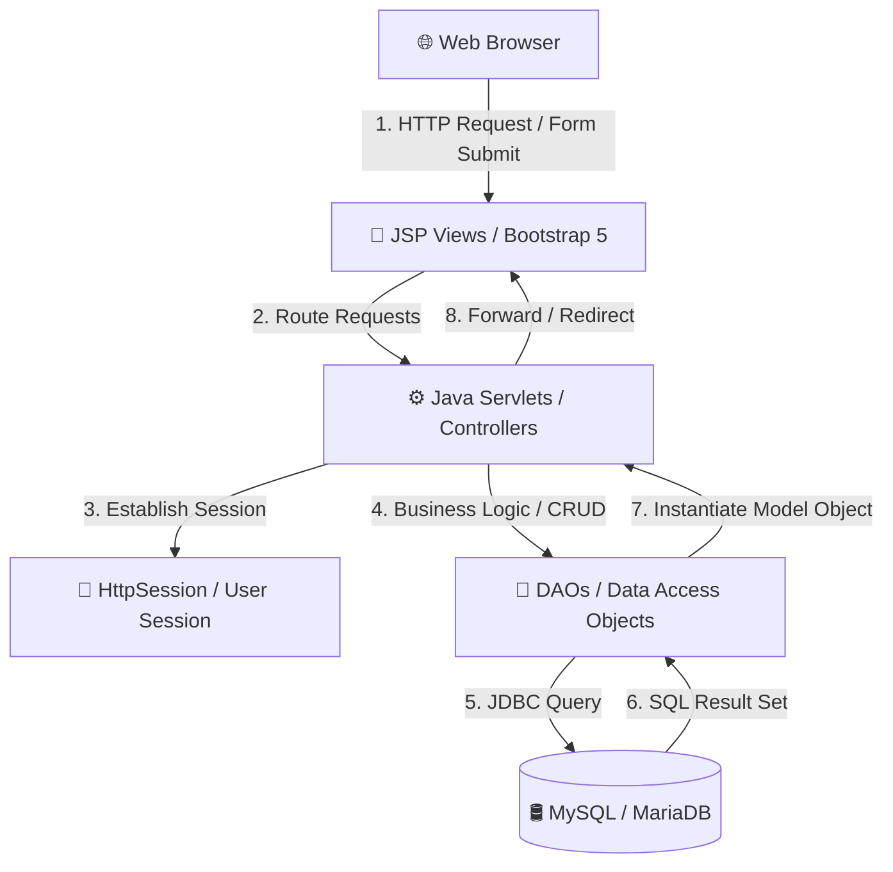
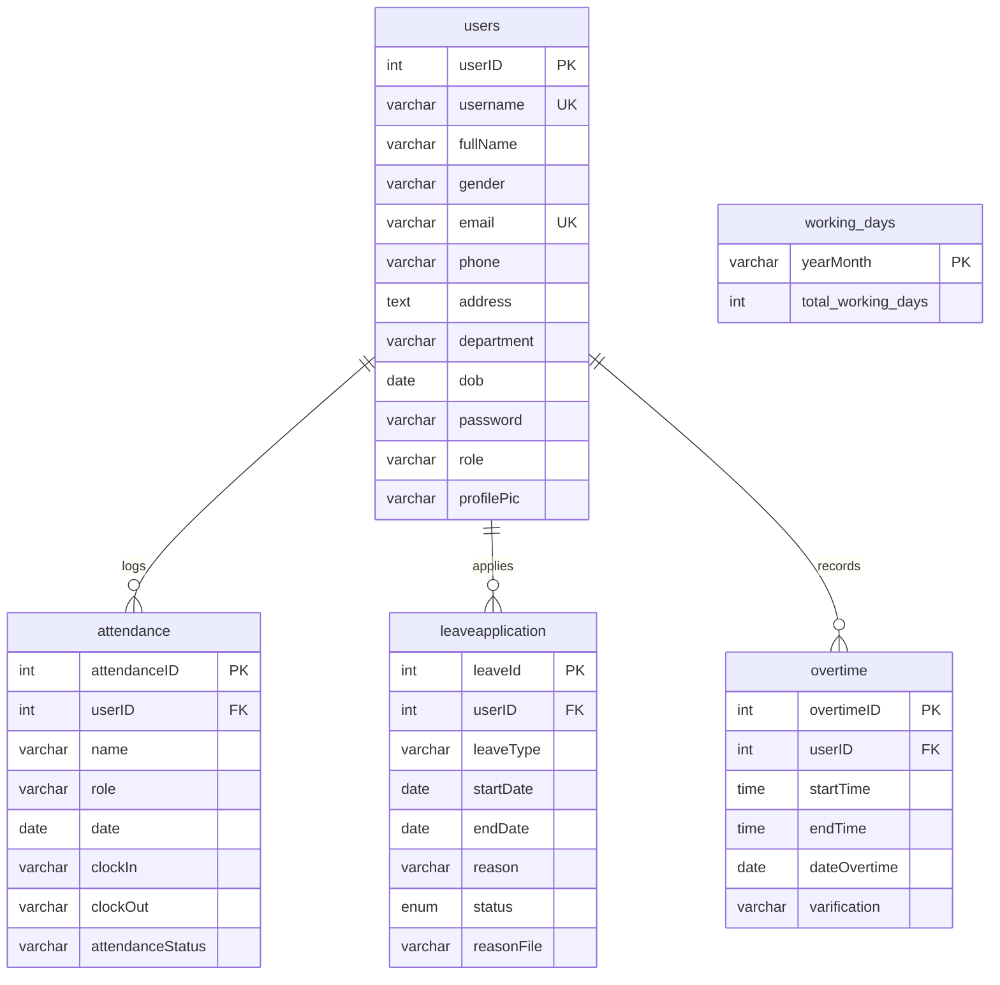

# 💼 Employee Attendance, Leave & Overtime Management System

[](https://www.oracle.com/java/)
[](https://tomcat.apache.org/)
[](https://www.mysql.com/)
[](https://getbootstrap.com/)
[](https://en.wikipedia.org/wiki/Model%E2%80%93view%E2%80%93controller)

A robust, enterprise-grade **Employee Management System** built with **Java Web (JSP & Servlets)**, designed to streamline employee workflows, automate attendance clocking, track overtime hours, manage leave applications (with medical certificate uploads), and generate dynamic monthly attendance reports.

---

## 🚀 Key Modules & Features

The system features **Role-Based Access Control (RBAC)** across four distinct organizational roles, each redirecting to a personalized dashboard experience:

### 1. 🕒 Attendance Management
*   **Real-time Clock In / Clock Out**: Quick, secure, and timestamped attendance tracking.
*   **Smart Attendance Statusing**: Automates status calculations (`Present`, `Late`, `Absent`) based on time criteria.
*   **Attendance Filtering**: Ability to filter and audit records by date, PTJ (Responsibility Centre), or role.
*   **Warning Letter System**: Generate warnings for employees exceeding threshold values of absenteeism or persistent lateness.

### 2. 📅 Leave Application System
*   **Comprehensive Leave Types**: Support for Sick Leave (SL), Annual Leave (AL), Paternity Leave (PL), Maternity Leave (ML), and Unpaid Leave (UL).
*   **Supporting Document Uploads**: Seamlessly attach proof of emergency or Medical Certificates (MC) to applications.
*   **Dynamic Document Downloads**: Head of PTJ can view and download attached files directly from the dashboard.
*   **Leave Workflow Status**: Applications progress through a standard review cycle (`Pending` → `Approved` or `Rejected`).

### 3. ⏳ Overtime Tracking
*   **Overtime Submission**: Log extra hours completed on specific dates, including start and end times.
*   **Approval Queue**: Supervisors/HRD can review submitted overtime requests to approve or reject them.
*   **Edit/Delete Overtime**: Staff can modify their overtime requests before approval.

### 4. 📊 Monthly Reporting & Analytics
*   **Attendance Report Generator**: Compiles and outputs comprehensive statistics.
*   **Working Days Configuration**: Dynamically calculate attendance percentage based on the specific month's working days setup.

---

## 🏛️ System Architecture

This project is built using the classic **Model-View-Controller (MVC)** architectural pattern:



*   **View (JSP / HTML5 / Bootstrap 5)**: Interacts with the user, collects inputs, and renders data fetched from the backend.
*   **Controller (Java Servlets)**: Handles client requests, manages user sessions, processes inputs, and controls the program flow.
*   **Model (Java Classes & DAOs)**: Encapsulates business data (e.g., `User`, `Attendance`, `LeaveApplication`, `Overtime`) and communicates with the database using JDBC.
*   **Database (MySQL)**: Retains persistent records.

---

## 🛢️ Database Schema & Roles

The system uses `attendancesystem1_db` which consists of five main tables:



### 👤 Role-Based Redirection Matrix
Upon successful authentication in the [LoginServlet](file:///src/java/servlet/LoginServlet.java), users are routed automatically to their target workspace:

| User Role | Target Dashboard | Scope of Operations |
| :--- | :--- | :--- |
| **Academician** | [aDashboard.jsp](file:///web/aDashboard.jsp) | Manage personal profile, record attendance, apply for leaves, view history. |
| **Supporting Staff** | [ssDashboard.jsp](file:///web/ssDashboard.jsp) | Record attendance, apply for leaves, submit/edit overtime logs, manage profile. |
| **Head of PTJ** | [ptjDashboard.jsp](file:///web/ptjDashboard.jsp) | Overview department attendance, approve/reject leave applications, download supporting docs. |
| **HRD** (Human Resource) | [dashboard.jsp](file:///web/dashboard.jsp) | Global user profile management (CRUD), global attendance auditing, overtime approvals, generate monthly reports. |

---

## 🛠️ Prerequisites & Setup Guide

### 1. Environment Requirements
*   **Java Development Kit (JDK)**: JDK 1.8 (Java 8) is highly recommended.
*   **Server**: Apache Tomcat 8.5 / 9.0 (Servlet Specification 3.1+ compatible).
*   **Database**: MySQL Server 5.7+ or MariaDB 10.4+.
*   **IDE**: Apache NetBeans 12.0+ (the project is pre-configured with NetBeans build and project files).

### 2. Database Deployment
1. Open your MySQL client (e.g., phpMyAdmin, MySQL Workbench, or Command Line).
2. Create a new database named `attendancesystem1_db`:
   ```sql
   CREATE DATABASE attendancesystem1_db;
   ```
3. Select the database and import the pre-configured SQL script located at:
   📂 [db/attendancesystem1_db (6).sql](file:///db/attendancesystem1_db%20(6).sql)
   ```bash
   mysql -u root -p attendancesystem1_db < "db/attendancesystem1_db (6).sql"
   ```

### 3. Database Credentials Configuration
Securely configure your database credentials inside [DBUtil.java](file:///src/java/util/DBUtil.java):

```java
// File: src/java/util/DBUtil.java
private static final String URL = "jdbc:mysql://localhost:3306/attendancesystem1_db";
private static final String USERNAME = "root";       // Change to your MySQL username
private static final String PASSWORD = "";           // Change to your MySQL password
```

> [!WARNING]  
> Never commit active passwords, private keys, or API tokens to public version control systems. It is recommended to use local environment configurations or a properties file in production.

### 4. Running the Project in NetBeans
1. Open **Apache NetBeans IDE**.
2. Go to **File** ➡️ **Open Project** and select the `testLogin` folder.
3. Right-click the project root, choose **Resolve Issues** (if any libraries or server targets are missing).
4. **Deploy MySQL Driver**:
   * Ensure that the `mysql-connector-j-9.2.0.jar` is resolved in your project classpath or download it and add it to **Libraries**.
5. Right-click the project and choose **Clean and Build**.
6. Right-click the project and click **Run**. Your browser will launch automatically at: `http://localhost:8080/testLogin/`

---

## 🔑 Test Credentials for Sandbox Evaluation

To facilitate swift testing and sandbox assessment of the RBAC redirection matrix, the database SQL dump provides several preconfigured profiles:

| Role | Username | Password | Account Details |
| :--- | :--- | :--- | :--- |
| **HRD** | `azhar` | `azhar123` | Muhammad Azhar (Global Admin / HR Controller) |
| **HRD** | `amir01` | `amir123` | Amir Hakim (HR Staff) |
| **Head of PTJ** | `wan` | `azhar123` | Wan Aimi (PTJ Approver) |
| **Head of PTJ** | `jaya` | `jaya` | Jaya Selan (PTJ Approver) |
| **Academician** | `haikal` | `yaya123` | Haikal Danial (Academic Profile) |
| **Academician** | `azlin88` | `azlin123` | Azlin Binti Mat (Academic Profile) |
| **Supporting Staff** | `yaya` | `yaya123` | Yaya Amirah (Overtime & Attendance Logger) |
| **Supporting Staff** | `mat` | `mat` | Mat (Overtime & Attendance Logger) |

---

## 📂 Project Directory Structure

```text
testLogin/
├── db/                              # Database SQL Dumps & Migrations
│   └── attendancesystem1_db (6).sql # Preloaded Database schema and mock data
├── nbproject/                       # Apache NetBeans configuration files
│   ├── project.properties           # Classpaths, source levels & server settings
│   └── project.xml                  # Dynamic web project definition
├── src/                             # Source code folder
│   └── java/                        # Backend Java Source classes
│       ├── model/                   # Data transfer objects & Entities
│       │   ├── User.java
│       │   ├── UserDAO.java         # User DB operations
│       │   ├── Attendance.java
│       │   ├── AttendanceDAO.java   # Attendance DB operations
│       │   ├── LeaveApplication.java
│       │   ├── LeaveApplicationDAO.java # Leave Application DB operations
│       │   ├── Overtime.java
│       │   └── OvertimeDAO.java     # Overtime DB operations
│       ├── servlet/                 # Web Controllers / Handlers
│       │   ├── LoginServlet.java
│       │   ├── LogoutServlet.java
│       │   ├── RegisterServlet.java
│       │   ├── EmployeeAttendanceServlet.java
│       │   ├── SaveLeaveAppServlet.java
│       │   └── OvertimeSubmitServlet.java
│       └── util/                    # Utility classes
│           └── DBUtil.java          # JDBC Connection Manager
├── web/                             # Web Frontend files
│   ├── WEB-INF/                     # Deployment descriptors
│   │   └── web.xml                  # Servlet Mapping and Welcome Page config
│   ├── includes/                    # Reusable frontend components
│   │   ├── aHeader.jsp              # Header for Academician
│   │   ├── hrdHeader.jsp            # Header for HRD
│   │   ├── ptjHeader.jsp            # Header for Head of PTJ
│   │   └── ssHeader.jsp             # Header for Supporting Staff
│   ├── login.jsp                    # Access portal page
│   ├── register.jsp                 # User registration portal
│   ├── dashboard.jsp                # HRD Dashboard portal
│   ├── aDashboard.jsp               # Academician Dashboard portal
│   ├── ptjDashboard.jsp             # Head of PTJ Dashboard portal
│   ├── ssDashboard.jsp              # Supporting Staff Dashboard portal
│   ├── uploads/                     # Upload directory for profile pictures
│   └── reasonFIle/                  # Upload directory for Leave attachments (MCs)
├── build.xml                        # Ant Build File
└── README.md                        # Project documentation (this file)
```

---

## 🛡️ Security & Best Practices

1. **Password Hashing**: The current build stores plain-text passwords for easy sandbox testing. For production deployments, implement a hashing algorithm (such as **BCrypt** or **Argon2**) during user registration (`RegisterServlet`) and authentication (`UserDAO.validate`).
2. **Access Control Filtering**: Implement a Java EE `Filter` to block unauthorized direct URL access to individual JSP dashboards (e.g. preventing a direct navigation request to `dashboard.jsp` unless session verification is satisfied).
3. **Prepared Statements**: All database operations use `PreparedStatement` classes, successfully mitigating the risk of **SQL Injection (SQLi)** vulnerabilities.

---
*Developed as part of Sem 4 Employee Management System Initiative.*
